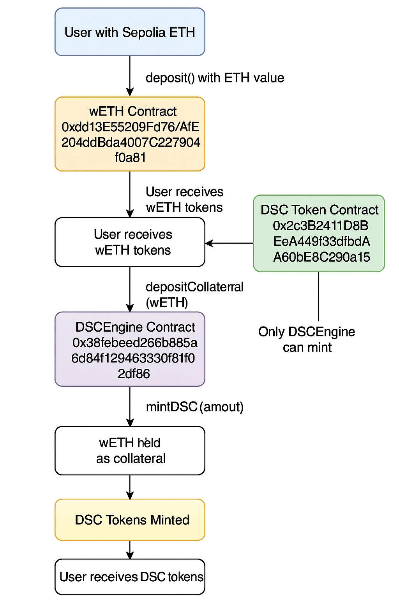

# DSC App Backend

A Next.js backend API for interacting with the DSC (Decentralized Stable Coin) smart contract ecosystem, including token operations and DeFi lending protocol functionality.

## Features

- **RESTful API** for smart contract interactions
- **Token Operations**: Mint, burn, transfer, approve, balance checking
- **DeFi Engine**: Deposit collateral, mint/burn DSC, liquidate positions
- **wETH Integration**: Seamless ETH wrapping and collateral workflows
- **Read Operations**: Token info, balance, allowance, account status, collateral info
- **Write Operations**: All token and engine transactions
- **Automated Workflows**: One-click ETH → wETH → Collateral → DSC minting
- **Input Validation**: Comprehensive address and amount validation
- **Error Handling**: Standardized error responses with detailed logging
- **Security**: Private key validation and transaction signing
- **API Status**: Built-in status endpoint with complete API documentation

## Prerequisites

- Node.js 18+ 
- npm or yarn
- Access to an Ethereum RPC endpoint (local, testnet, or mainnet)

## Smart Contract Integration

The backend integrates with two main smart contracts:

### DSC Token Contract (`0x2c3B2411D8BEeA449f3dfbdAA80bE8C290a159C3`)
- **ERC20 Token** with mint/burn functionality
- **Owner-controlled minting** for initial distribution
- **Standard ERC20 functions**: transfer, approve, allowance, balanceOf

### DSC Engine Contract (`0x38febeed266b885a6d84f129463330f81f02df86`)
- **DeFi Lending Protocol** with collateral management
- **Collateral deposits** and **DSC minting**
- **Health factor monitoring** and **liquidation system**
- **Price feed integration** for collateral valuation

### wETH Contract (`0xdd13E55209Fd76AfE204dBda4007C227904f0a81`)
- **Wrapped Ethereum** for Sepolia testnet
- **1:1 ETH to wETH** conversion ratio
- **ERC20 standard** with deposit/withdraw functionality
- **Collateral token** for DSC Engine integration

## wETH Integration Workflows

The backend provides seamless ETH to DSC workflows through wETH integration:

### Traditional Flow (Multi-step)
1. User wraps ETH to wETH externally
2. User approves DSC Engine to spend wETH
3. User deposits wETH as collateral
4. User mints DSC tokens

### Integrated Flow (One API call)
```
Sepolia ETH → wETH Contract → wETH Tokens → DSC Engine → DSC Tokens
``` 

### Workflow Chart from getting wETH to minting DSC 

